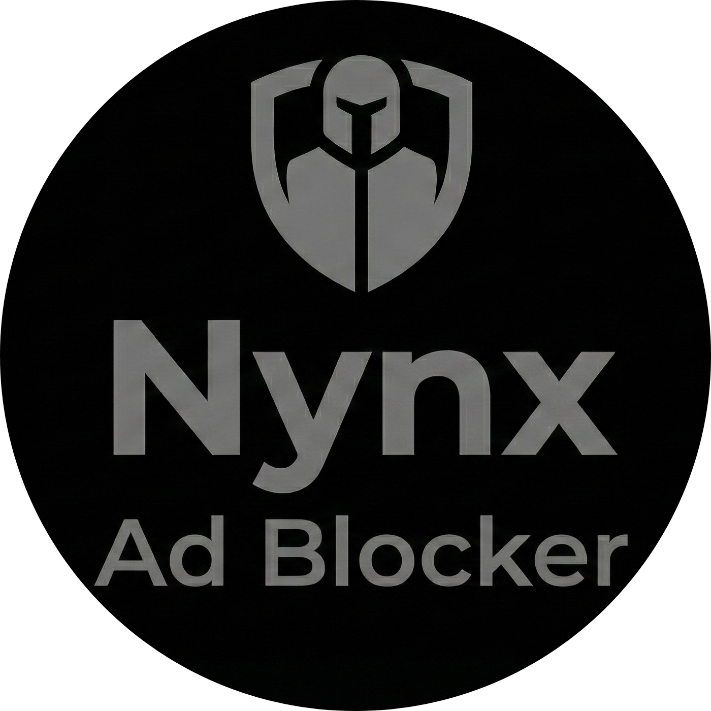

# Installing Nynx Shield on Microsoft Edge

<p align="center">
  
</p>

This guide will walk you through installing Nynx Shield from source on Microsoft Edge.

---

## Prerequisites

- Microsoft Edge version **88 or higher**
- The Nynx Shield source code (downloaded or cloned)

---

## Step-by-Step Installation

### Step 1: Download the Source Code

**Option A: Clone with Git**
```bash
git clone https://github.com/bhaskarsaikia-17/Nynx-Shield.git
```

**Option B: Download ZIP**
1. Go to the [GitHub repository](https://github.com/bhaskarsaikia-17/Nynx-Shield)
2. Click the green **Code** button
3. Select **Download ZIP**
4. Extract the ZIP file to a folder on your computer

---

### Step 2: Open Edge Extensions Page

Open Edge and navigate to the extensions page using one of these methods:

- **Method 1**: Type `edge://extensions` in the address bar and press Enter
- **Method 2**: Click the menu (**...**) → **Extensions** → **Manage extensions**

---

### Step 3: Enable Developer Mode

1. Look for the **Developer mode** toggle in the bottom-left corner of the page
2. Click to enable it (toggle should turn blue)

---

### Step 4: Load the Extension

1. Click the **Load unpacked** button that appears after enabling Developer mode
2. Navigate to the Nynx Shield folder you downloaded/cloned
3. Select the **`extension`** folder (not the root folder)
4. Click **Select Folder**

---

### Step 5: Verify Installation

After loading, you should see:
- ✅ Nynx Shield appears in your extensions list
- ✅ The Nynx Shield icon appears in your browser toolbar
- ✅ No error messages are displayed

---

## Pin the Extension (Recommended)

1. Click the **Extensions icon** (puzzle piece 🧩) in the toolbar
2. Find **Nynx Shield** in the dropdown
3. Click the **eye icon** (👁️) to show it in the toolbar

Now you can easily access Nynx Shield with one click!

---

## Allow in InPrivate (Optional)

If you want Nynx Shield to work in InPrivate windows:

1. Go to `edge://extensions`
2. Click **Details** on the Nynx Shield card
3. Enable **Allow in InPrivate**

---

## Updating the Extension

When you download a new version:

1. Replace the old `extension` folder with the new one
2. Go to `edge://extensions`
3. Click the **reload icon** (🔄) on the Nynx Shield card

---

## Troubleshooting

### Extension doesn't load?
- Make sure you selected the **`extension`** folder, not the root project folder
- Check that `manifest.json` exists inside the selected folder

### Icon doesn't appear?
- Click the Extensions icon (🧩) and enable visibility for Nynx Shield
- Try reloading the extension

### Errors in the extension card?
- Click to expand error details
- Make sure you have Edge 88 or higher

### "Allow extensions from other stores" message?
- This shouldn't appear for unpacked extensions, but if it does, click **Allow**

---

## Need Help?

- 📖 [Full Documentation](../README.md)
- 🐛 [Report Issues](https://github.com/bhaskarsaikia-17/Nynx-Shield/issues)
- 💬 [Discussions](https://github.com/bhaskarsaikia-17/Nynx-Shield/discussions)
